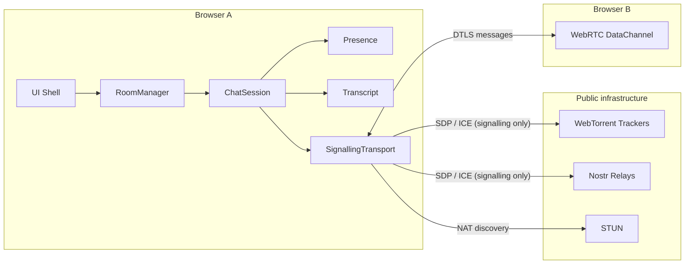

# ZenChat

Serverless browser P2P chat for GitHub Pages. No backend. Peers meet through public WebTorrent trackers or Nostr relays, then talk over WebRTC DataChannels.

部署在 GitHub Pages 上的无服务器 P2P 聊天室。没有后端。浏览器经公共 WebTorrent Tracker 或 Nostr 中继相遇，消息只走 WebRTC DataChannel。

**Live / 在线：** https://andyccr.github.io/ZenChat/

---

## Architecture / 架构



| Layer / 层 | Role / 职责 |
|---|---|
| UI Shell | Lobby, tabs, theme. Chat pane is a separate view; shell does not remount on switch. |
| RoomManager | Room lifecycle, log cache, skip reconnect if the same room is already joined. |
| ChatSession | Orchestrates hello / chat / typing over an injected transport and runtime. |
| Presence / Transcript | Members + typing TTL; capped message log and dedupe ids. |
| Transport factory | Default Trystero torrent/nostr. Tests inject a fake. A `Libp2pTransport` can plug in here. |
| DataChannel | Encrypted chat after ICE succeeds. Trackers never see plaintext. |

---

## English

### Why this stack

GitHub Pages can only host static files. WebRTC still needs signalling (SDP / ICE). ZenChat does **not** run its own signalling server. It reuses public P2P infrastructure:

- **Default:** WebTorrent WebSocket trackers (the P2PT path, via Trystero).
- **Fallback:** public Nostr relays, same app protocol.
- **ICE:** public STUN only. TURN needs secrets, so it cannot be baked into a static site. Symmetric NAT may fail.

libp2p / WebPEER is heavier (DHT, muxers) and a better fit later if you need Go/Rust nodes or Circuit Relay.

### Use

```bash
npm install
npm test
npm run dev
```

Open two windows, join the same room. Top tabs or `Ctrl/Cmd+K` switch rooms. 「顔」 inserts kaomoji/emoji. Theme cycles Auto / Light / Dark.

On a phone, nickname + room + **Join** sit above the fold. Chat uses a fixed viewport: the composer stays on screen (including when the keyboard opens via `visualViewport`). Members are a sheet, not a second column you have to scroll past.

### Deploy

This repo’s Pages setting is **Deploy from a branch: `main` / **. Do not serve the Vite source HTML.

1. Source entry is `src/index.html`. `npm run build:pages` writes compiled `index.html` + `assets/` at the repo root.
2. After merge, GitHub serves those files. An Action on `main` rebuilds and commits if needed.
3. Open https://andyccr.github.io/ZenChat/ over **HTTPS**.

### Pitfalls

| Issue | What to do |
|---|---|
| Insecure context | HTTPS or localhost only |
| Project-site `base` | Production build uses `/ZenChat/` |
| Dead trackers | Several `wss://` URLs; switch to Nostr in the UI |
| Symmetric NAT | No TURN on a static host; same LAN usually works |
| Mesh scale | One WebRTC link per pair — keep rooms small |

References: [Chitchatter](https://chitchatter.im/), [WebPEER demo](https://nuzulul.github.io/webpeerjs/demo/chat.html).

---

## 中文

### 为什么这样选

GitHub Pages 只能托管静态文件。WebRTC 仍需要信令。ZenChat **不自建**信令服务，只复用公共 P2P 设施：

- **默认：** WebTorrent WebSocket Tracker（P2PT / Trystero）
- **备选：** 公共 Nostr 中继，同一套应用协议
- **ICE：** 仅公共 STUN。TURN 需要密钥，不能安全写进纯静态站；对称 NAT 可能连不上。

libp2p / WebPEER 更重，适合以后要和 Go/Rust 节点组网或 Circuit Relay 时再接。

### 使用

```bash
npm install
npm test
npm run dev
```

两个窗口进同一房间即可互发。顶栏标签或 `Ctrl/Cmd+K` 切房间。「顔」插入颜文字/表情。主题：自动 / 浅色 / 深色。

手机上：昵称、房间、**加入**都在首屏，不用下滑。聊天是固定视口，输入框钉在底部（键盘弹出时用 `visualViewport` 收缩高度）。成员列表是浮层，不会把输入框顶出屏幕。

### 部署

当前 Pages 是 **从 `main` 根目录发布**。不要只上传 Vite 源码里的 `index.html`。

1. 源码入口 `src/index.html`。`npm run build:pages` 把可运行的 `index.html` 和 `assets/` 写到仓库根目录。
2. 合并后 GitHub 直接托管这些文件；`main` 上的 Action 也会再编译并回写。
3. 用 **HTTPS** 打开 https://andyccr.github.io/ZenChat/

### 注意

| 问题 | 对策 |
|---|---|
| 非安全上下文 | 只用 HTTPS 或 localhost |
| 项目站路径 | 生产构建 `base` 为 `/ZenChat/` |
| Tracker 宕机 | 多条 `wss://`；界面可切 Nostr |
| 对称 NAT | 静态站没有 TURN；同一局域网通常可以 |
| Mesh 规模 | 每对浏览器一条连接，用房间拆分 |

参考：[Chitchatter](https://chitchatter.im/)、[WebPEER demo](https://nuzulul.github.io/webpeerjs/demo/chat.html)。

---

License: GNU AGPL v3. The UI links to source to satisfy the network-interaction clause.
